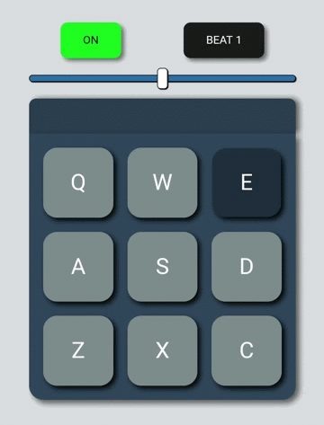

# Drum Machine

> A beat board to find your musician side.

---

### Table of Contents
- [Description](#description)
- [Technologies](#technologies)
- [How To Use](#how-to-use)
- [Installation](#installation)
- [License](#license)

---

## Description
- Beat machine to find your inner musician.
- Choose from 2 unique beat banks.
- Click on each pad to produce unique sounds.
- Alternatively you can use the keyboard keys Q, W, E, A, S, D, Z, X, C.
- Responsive.
- Control the volume with a slider.

---

## Technologies
- React
- JavaScript
- HTML
- CSS

---

## How To Use
You can view the hosted project [here](https://vshalt.github.io/drum-machine) or https://vshalt.github.io/drum-machine

---

## Installation
- You will need node to run the project locally.
- Clone the repository to your local machine with `git clone https://github.com/vshalt/drum-machine`.
- Change the current directory to the newly cloned repository.
- Install all the required dependencies with `npm install`.
- After the installations are done start the project locally on your machine with `npm start`.
- Navigate to `localhost:3000` in your browser
- Enjoy!
---

## License
MIT License
[Read here](./LICENSE)

[Back To The Top](#drum-machine)
